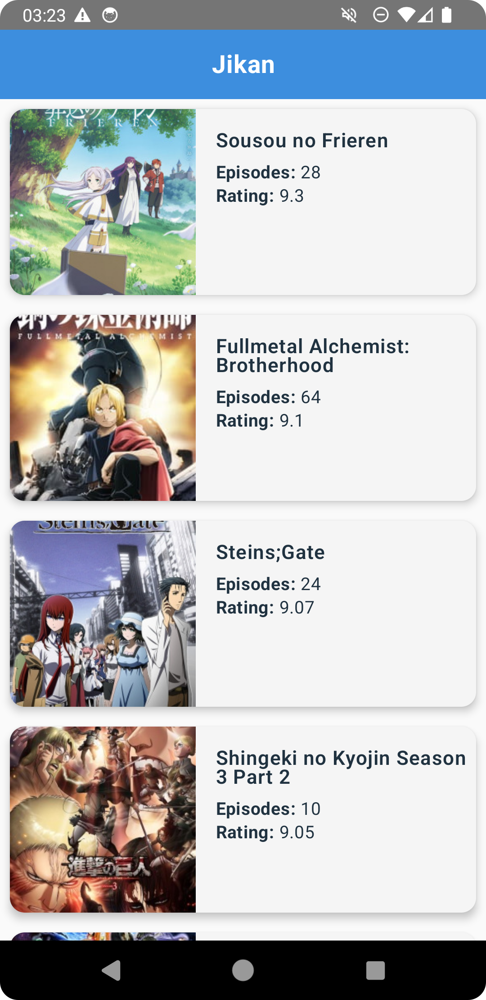
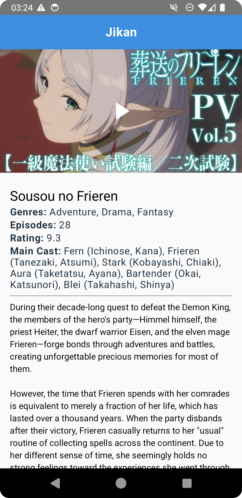

# JikanAnimeApp 📱
*A simple offline-first Anime App using Jikan API*

---

## Overview

This Android app uses the **Jikan REST API** to fetch and display a list of popular anime. Users can tap any anime to view detailed information along with a playable trailer and main voice cast. The app uses **Room** to store both list and detail data for offline access, supports automatic background syncing using **WorkManager**, and follows clean architecture principles with **MVVM + Hilt + Repository**.

---

## Features ✅

### ✅ Anime List Page
- Fetches top anime from `https://api.jikan.moe/v4/top/anime`
- Displays **Title**, **Episodes**, **Rating**, and **Poster**
- Offline support (loads from cache)

### ✅ Anime Detail Page
- Fetches details from `https://api.jikan.moe/v4/anime/{id}`
- Displays:
  - Trailer (YouTube embed / WebView)
  - Title & Synopsis
  - Genres
  - Main Cast (top characters + voice actors)
  - Episodes
  - Rating
- Caches detail for offline access

### ✅ Local Database (Room)
- Stores Anime list & details separately
- Loads from Room when offline

### ✅ Offline Mode & Sync
- Fully usable without internet after first fetch
- Periodic refresh via WorkManager (every 12 hours, only if online)

### ✅ Error Handling
- Gracefully handles API failures (no crash)
- Shows empty state with Retry button when list is empty

### ✅ Architecture
- MVVM with Repository
- Hilt for dependency injection
- Retrofit & Gson for API
- Room for DB
- Glide (and optional Coil) for image loading
- StateFlow for UI state

### ✅ Legal Constraint Handling
- Build-time flag `BuildConfig.HIDE_POSTERS`
- If poster images are disabled, layout remains stable and shows placeholders instead

---

## Screenshots

### Home Screen

### Anime Detail Screen

---
